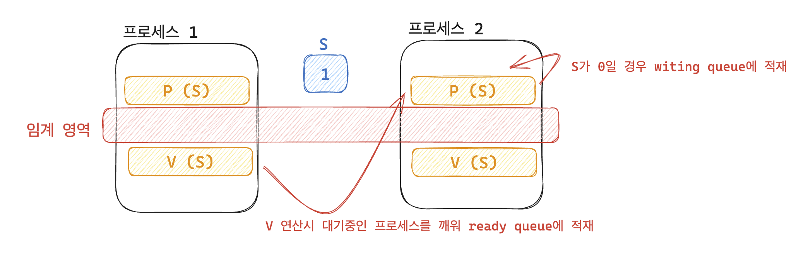

# DispatcherServlet

> DispatcherServlet의 내부 구현에 대해 정리한 글입니다.

## ？ DispatcherServlet이란

&#x20;**`DispatcherServlet`**은 스프링 MVC 구성의 핵심이다. 아래와 같은 역할을 한다.

1. **`DispatcherServlet`**은 외부 클라이언트로 부터 오는 HTTP 요청을 받아서 적절한 Controller로 위임하는 프론트 컨트롤러 역할을 한다. 개발자가 직접 HTTP 요청을 분석해 적절한 Controller로 위임하는 수고를 줄여준다.
2. 들어오는 모든 요청을 처리하기 때문에 인터셉터나 ArgumentResolver 같은 공통 처리를 간편하게 사용할 수 있게 도와준다.

위처럼 **`DispatcherServlet`**을 사용하게 되면서 개발자는 HTTP 분석 등 귀찮은 작업을 하지 않아도 되며 비즈니스 로직에 집중할 수 있게 된다.


**DispatcherServlet**이 어떤 구조로 이루어져 있는지, 어떤 기능을 어떤 순서로 제공하는지 코드를 통해 살펴보았다.


## 🌲 DispatcherServlet 구조

<figure><figcaption></figcaption></figure>

Servlet부터 DispatcherServlet까지의 내부 구조와 흐름에 대해 정리해보았다.

### 1. Servlet

<figure><figcaption></figcaption></figure>

참고 : [https://www.baeldung.com/intro-to-servlets](https://www.baeldung.com/intro-to-servlets)

* 웹페이지를 동적으로 생성하며  외부 요청을 처리하고 응답하기 위한 인터페이스
* 서블릿 덕분에 HTTP 요청 뿐만 아니라 다양한 유형의 요청을 동적으로 처리하여 응답 가능
* 해당 인터페이스에는 `init()`, `service()`, `destroy()`와 같이 서블릿의 생명주기 및 처리에 대한 추상 메서드가 정의되어 있다.
* 따라서 서블릿의 **생명주기**는 `init() → service() → destroy()`임을 알 수 있다.


### 2. HttpServlet

<figure><figcaption></figcaption></figure>

**`HttpServlet`**은 **`Servlet`**을 상속한 추상 클래스인 **`GenericServlet`**을 상속한 추상 클래스이다.

<figure><figcaption></figcaption></figure>


Servlet이 HTTP 요청에 맞게 생명주기를 갖도록 아래와 같이 구현을 했다.

* HTTP 요청을 처리할 수 있는 서블릿에 대한 추상클래스이다.
* PATCH를 제외한 HTTP Method에 대한 처리가 존재한다.


HttpServlet에는 Servlet 요청을 HTTP 요청으로 변환하는 과정이 Servlet의 두 번째 생명주기였던 **`service`** 메서드에 존재한다.

1. **`Service`** 메서드를 통해 **`Servlet`** 요청과 응답을 **`HttpServlet`** 요청과 응답으로 변환한다.

```java
@Override
public void service(ServletRequest req, ServletResponse res) throws ServletException, IOException {

    HttpServletRequest request;
    HttpServletResponse response;

    try {
        request = (HttpServletRequest) req;
        response = (HttpServletResponse) res;
    } catch (ClassCastException e) {
        throw new ServletException(lStrings.getString("http.non_http"));
    }
    service(request, response);
}
```


2. 변환된 **`HttpServlet`** 요청과 응답의 HTTP Method에 맞게 처리를 위한 메서드를 호출한다. (doGet, doPost ...)

```java
protected void service(HttpServletRequest req, HttpServletResponse resp) throws ServletException, IOException {

        String method = req.getMethod();

        if (method.equals(METHOD_GET)) {
            long lastModified = getLastModified(req);
            if (lastModified == -1) {
                doGet(req, resp);
            } else {
                ...
            }

        } else if (method.equals(METHOD_HEAD)) {
            long lastModified = getLastModified(req);
            maybeSetLastModified(resp, lastModified);
            doHead(req, resp);

        } else if (method.equals(METHOD_POST)) {
            doPost(req, resp);

        } else if (method.equals(METHOD_PUT)) {
            doPut(req, resp);

        } else if (method.equals(METHOD_DELETE)) {
            doDelete(req, resp);

        } else if (method.equals(METHOD_OPTIONS)) {
            doOptions(req, resp);

        } else if (method.equals(METHOD_TRACE)) {
            doTrace(req, resp);

        } else {
            ...
            resp.sendError(HttpServletResponse.SC_NOT_IMPLEMENTED, errMsg);
        }
    }
```


3. 단, **`HttpServlet`**에서의 doGet, doPost와 같은 HTTP Method별 처리 메서드는 모두 에러를 반환하는 **`sendMethodNotAllowed`**를 호출한다. 따라서 구현체를 통해 해당 처리 메서드를 재정의를 해야 적절한 처리가 가능하다. -> **`FrameworkServlet`** 에 구현되어 있다.

<figure><figcaption></figcaption></figure>

<figure><figcaption></figcaption></figure>


### 3. HttpServletBean

<figure><figcaption></figcaption></figure>

* **Spring**에서 **`HttpServlet`**에 대한 구현을 한 추상클래스이다.
*   이 구현체부터는 Spring 프레임워크의 기술이다.

    ```
    package org.springframework.web.servlet;
    ```
* Servlet 라이프사이클을 Bean 라이프사이클에 맞출 수 있고 Spring의 의존성 주입도 이용할 수 있다.


### 4. FrameworkServlet

<figure><figcaption></figcaption></figure>

* **`HttpServlet`**의 doGet, doPost 등에 대한 처리가 구현되어 있다.
* **`HttpServlet`**은 doGet, doPost 등에 대한 구현 책임을 자식 객체로 위임했기 때문에 해당 HTTP Method를 지원하기 위해서 오버라이드를 통해 기능이 구현 되어있다.


service 메서드를 살펴보면 **`HTTP_SERVLET_METHODS`**에 포함될 경우 super를 통해 **`HttpServlet`**으로 요청을 위임한다.

```java
@Override
protected void service(HttpServletRequest request, HttpServletResponse response)throws ServletException, IOException {
	if (HTTP_SERVLET_METHODS.contains(request.getMethod())) {
		super.service(request, response);
	}
	else {
		processRequest(request, response);
	}
}
```


FrameworkServlet의 **`HTTP_SERVLET_METHODS`**라는 상수값을 보면 **`PATCH`**만 제외되어 있다.

```java
private static final Set<String> HTTP_SERVLET_METHODS = 
Set.of("DELETE", "HEAD", "GET", "OPTIONS", "POST", "PUT", "TRACE");
```


**`PATCH`** 요청은 나중에 지원돼서 그렇다 카더라

출처 : [https://en.wikipedia.org/wiki/PATCH\_(HTTP)#History\_of\_PATCH](https://en.wikipedia.org/wiki/PATCH\_\(HTTP\)#History\_of\_PATCH)


FrameworkServlet에는 doGet, doPost 등등에 대한 처리 방법이 구현되어 있다. 공통적으로 processRequest를 이용해 처리한다.

<figure><figcaption></figcaption></figure>


**`processRequest`**에는 **`doService`**를 호출한다. 하지만 doService는 추상 메서드 이므로 최종 구현체인 **`DispatcherServlet`**에서 실제 HTTP 요청에 대한 처리를 구현하게 된다.

<figure><figcaption></figcaption></figure>


### 5. DispatcherServlet

<figure><figcaption></figcaption></figure>

**`FrameworkServlet`**에서 HTTP 요청에 대한 처리 구현을 doService라는 추상 메서드로 정의했기 때문에 구현체인 **`DispatcherServlet`**에서 오버라이드로 구현해야 한다.


#### 5.1 doService

코드가 길기 때문에 중요한 내용만 축약하면 **`doService`** 내에서 **`doDispatch`**의 호출을 확인할 수 있다.

```java
@Override
protected void doService(HttpServletRequest request, HttpServletResponse response) throws Exception {
	try {
		doDispatch(request, response);
	}
	finally {
	}
}
```


#### 5.2 doDispatch

**`doDispatch`**는 아래와 같다. 전체 흐름을 주석으로 달아놨다.

```java
protected void doDispatch(HttpServletRequest request, HttpServletResponse response) throws Exception {
    // 요청을 처리하기 위해 처리된 요청 및 매핑된 핸들러를 초기화
    HttpServletRequest processedRequest = request;
    HandlerExecutionChain mappedHandler = null;
    boolean multipartRequestParsed = false;

    // 비동기 요청 관리
    WebAsyncManager asyncManager = WebAsyncUtils.getAsyncManager(request);

    try {
        ModelAndView mv = null;
        Exception dispatchException = null;

        try {
            // 멀티파트 요청 확인
            processedRequest = checkMultipart(request);
            multipartRequestParsed = (processedRequest != request);

            // 현재 요청에 대한 핸들러를 결정
            mappedHandler = getHandler(processedRequest);
            if (mappedHandler == null) {
                // 핸들러가 없는 경우 처리
                noHandlerFound(processedRequest, response);
                return;
            }

            // 현재 요청에 대한 핸들러 어댑터를 결정
            HandlerAdapter ha = getHandlerAdapter(mappedHandler.getHandler());

            // Get, Head 메서드이면서 핸들러에서 지원하는 경우, 
            // 최신 수정일을 확인하여 클라이언트의 캐시가 최신인지 확인
            String method = request.getMethod();
            boolean isGet = HttpMethod.GET.matches(method);
            if (isGet || HttpMethod.HEAD.matches(method)) {
                long lastModified = ha.getLastModified(request, mappedHandler.getHandler());
                if (new ServletWebRequest(request, response).checkNotModified(lastModified) && isGet) {
                    return;
                }
            }

            // PreHandle을 적용
            if (!mappedHandler.applyPreHandle(processedRequest, response)) {
                return;
            }

            // 핸들러를 실제로 호출
            mv = ha.handle(processedRequest, response, mappedHandler.getHandler());

            // 비동기 처리가 시작되었는지 확인하고 종료
            if (asyncManager.isConcurrentHandlingStarted()) {
                return;
            }

            // 뷰 이름을 적용하고 PostHandle을 적용
            applyDefaultViewName(processedRequest, mv);
            mappedHandler.applyPostHandle(processedRequest, response, mv);
        }
        catch (Exception ex) {
            dispatchException = ex;
        }
        catch (Throwable err) {
            // 핸들러 메서드에서 발생한 에러를 @ExceptionHandler에서 사용할 수 있도록 처리
            dispatchException = new ServletException("Handler dispatch failed: " + err, err);
        }
        // Dispatch 결과를 처리
        processDispatchResult(processedRequest, response, mappedHandler, mv, dispatchException);
    }
    catch (Exception ex) {
        // 예외처리
        triggerAfterCompletion(processedRequest, response, mappedHandler, ex);
    }
    catch (Throwable err) {
        // 오류처리
        triggerAfterCompletion(processedRequest, response, mappedHandler,
                new ServletException("Handler processing failed: " + err, err));
    }
    finally {
        if (asyncManager.isConcurrentHandlingStarted()) {
            // 비동기 처리인 경우 처리
            if (mappedHandler != null) {
                mappedHandler.applyAfterConcurrentHandlingStarted(processedRequest, response);
            }
        }
        else {
            // 멀티파트 요청에 사용된 리소스를 정리
            if (multipartRequestParsed) {
                cleanupMultipart(processedRequest);
            }
        }
    }
}
```


**`doDispatch`**에서 실행되는 순서는 다음과 같다.

1. HandlerMapping을 통해 Handler 조회
2. 조회한 Handler를 처리할 HandlerAdapter 조회
3. Request에 인터셉터의 PreHandle 적용 (필요시)
4. 조회한 HandlerAdapter로 전처리 진행 후 요청 전송
5. Response에 인터셉터의 PostHandle, AfterCompletion을 적용 (필요시)

```java
protected void doDispatch(HttpServletRequest request, HttpServletResponse response) throws Exception {
		HttpServletRequest processedRequest = request;
		HandlerExecutionChain mappedHandler = null;

		try {
			try {
				processedRequest = checkMultipart(request);

				// 1. HaddlerMapping을 통해 Handler 조회
				mappedHandler = getHandler(processedRequest);

				// 2. Haddler를 처리할 HaddlerAdapter 조회
				HandlerAdapter ha = getHandlerAdapter(mappedHandler.getHandler());

				...
				
				// 3. Request에 인터셉터의 PreHandle 적용 (필요시)
				if (!mappedHandler.applyPreHandle(processedRequest, response)) {
					return;
				}

				// 4. 조회한 HandlerAdapter로 전처리 진행 후 요청 전송
				mv = ha.handle(processedRequest, response, mappedHandler.getHandler());

				if (asyncManager.isConcurrentHandlingStarted()) {
					return;
				}

				applyDefaultViewName(processedRequest, mv);
				mappedHandler.applyPostHandle(processedRequest, response, mv);
			}
			catch (Exception ex) {
				dispatchException = ex;
		
			processDispatchResult(processedRequest, response, mappedHandler, mv, dispatchException);
		}
		catch (Exception ex) {
			...
		}
		finally {
			...
		}
	}

```


#### 5.3 doDispatch 내부 동작 과정

#### 1. HandlerMapping을 통해 Handler 조회

```java
mappedHandler = getHandler(processedRequest);
```


client로부터 받은 HttpServletRequest를 getHandler를 호출하여 HandlerMapping에 처리할 Handler가 있는지 확인하고 Handler를 반환한다.

```java
@Nullable
protected HandlerExecutionChain getHandler(HttpServletRequest request) throws Exception {
	if (this.handlerMappings != null) {
		for (HandlerMapping mapping : this.handlerMappings) {
			HandlerExecutionChain handler = mapping.getHandler(request);
			if (handler != null) {
				return handler;
			}
		}
	}
	return null;
}
```


#### 2. 조회한 Handler를 처리할 HandlerAdapter 조회

```
HandlerAdapter ha = getHandlerAdapter(mappedHandler.getHandler());
```


위에서 조회한 Handler를 통해 HadlerAdapter 목록을 확인하여 처리할 Adaptoer를 반환한다.

```java
protected HandlerAdapter getHandlerAdapter(Object handler) throws ServletException {
	if (this.handlerAdapters != null) {
		for (HandlerAdapter adapter : this.handlerAdapters) {
			if (adapter.supports(handler)) {
				return adapter;
			}
		}
	}
	...
}
```


#### 3. Request에 인터셉터의 PreHandle 적용 (필요시)

```java
if (!mappedHandler.applyPreHandle(processedRequest, response)) {
    return;
}
```

Request에 대해 인터셉터가 적용된다면 @Prehandle을 적용한다.


#### 4. 조회한 HandlerAdapter로 전처리 진행 후 요청 전송

```java
mv = ha.handle(processedRequest, response, mappedHandler.getHandler());
```

ArgumentResolve를 처리하고 실제 요청을 Controller로 전송하게 된다.


## 🚚 DispatcherServlet과 HTTP 요청 처리 과정

요청 처리의 흐름을 도식화해서 순서대로 살펴보고 마무리하겠다.

<figure><figcaption></figcaption></figure>

1. Client가 HTTP Request를 Web Server에 요청
2. Filter Chain 후 DispatcherServlet에서 요청 처리(doDispatch)&#x20;
3. HandlerMapping에서 요청을 처리할 Handler(Controller) 조회
4. Handler를 처리할 Handler Adapter로 요청 (실제로는 요청을 보내기 전 Interceptor의 Prehandle이 적용)
5. Controller에서 비즈니스 요청 처리를 한 후 Model And View 반환
