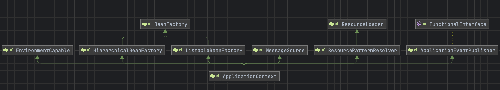

# SSE + Stream 방식 문제점

> 멈무일기 프로젝트에 SSE와 Stream 방식을 사용하게 되면서 발생한 문제와 해결 과정을 정리한 글입니다.

## SSE + Stream방식

### 1. SSE를 사용한 이유

기본적인 HTTP 요청은 stateless하기 때문에 client가 요청 후 connection이 종료되게 된다.

하지만&#x20;

### 2. Stream을 적용한 이유

chatGPT API를 호출하는 시간은 최소 5초에서 최대 30초까지 굉장히 긴 시간이 소요됐다.

프로젝트 흐름상, chatGPT가 생성한 데이터가 존재해야 다음 Flow로 진행이 가능했기 때문에 요청 시간동안 loading circle을 띄워서 요청 처리 중이라는 것을 사용자에게 알려줬다.

사용자가 애플리케이션을 쓰면서 로딩 화면을 5초이상 본다는 것은 UX 측면에서 좋지 않다고 생각해서 요청이 완전이 종료된 후 데이터를 받아오는 것이 아닌, 완료된 요청을

## 개발 과정

Webflux의 Flux를 이용해 Stream을 처리했다. 이용해 요청을 처리했다.

Stream으로 여러 데이터를 emit해야하기 때문에 Mono가 아닌 Flux 타입으로 반환을 했다.

<figure><figcaption></figcaption></figure>

다만 개발하면서 성능상에 문제가 몇가지 발생했다.

## 성능 문제 1 - OSIV

개발 서버에 배포 후 프론트에서 테스트를 진행했다.

요청이 10개정도 이상 연속으로 보내게 되면 서버가 닫히는 문제가 발생했다.

우선 확인해 본 것은 서버의 로그였으나 이유를 알 수가 없었다?

## 성능 문제 2 - Nginx proxy buffering

로컬에서 테스트 했을 때는 문제 없었지만 온프레미스 서버에 배포 후에 stream 데이터가 한 글자씩 반환되지 않고 덩어리로 가는 문제가 발생했다.

server의 로그를 확인해 봤을 때는 한 글자씩 끊어서 보냈으나 Client에게는 뭉쳐져서 보내졌기 때문에 반쪽짜리 Stream이 되었다.

서버의 배포 환경은 아래와 같았다.

Nginx의 문제인 것 같아서 default 설정을 찾아봤다.

proxy buffering의 default가 true로 설정되어 있어 서버에서 나가는 응답이 Nginx에서 버퍼에 쌓이고 특정 크기 이상이 될 경우에 응답이 전해지는 방식을 확인했다.

우선 모든 API Path에 대해 proxy buffering을 false로 설정하고 테스트를 해봤더니 잘 동작했다.

하지만 proxy buffering은 성능을 위해 on을 두는 것이 좋다고 하여 chatGPT API Path에 대해서만 false로 설정했다.

## 적용 후

